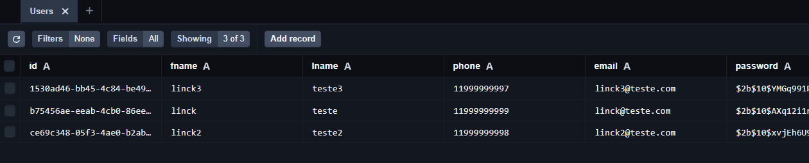

# Iniciar o projeto

### OBS.
#### O projeto não entende o arquivo ".env.development", sendo necessário alterar o nome dele para ".env" pois é nele que estão as configurações necessárias para comunicação com o banco de dados, lembre de criar a connectionString do MongoDB e adicionar nesse arquivo no atributo: CONNECTION_STRING_DB.

#### Será necessário a instalação do node na versão 20.14.x e o npm versão 10.7.x, você pode ter problemas de execução caso esteja com uma versão mais Antiga/Nova, para verificar as suas versões, abra o terminal e execute os seguintes comandos: 

```
node --version

npm --version
```

#### Para iniciar o projeto, navegue até a pasta onde o projeto foi clonado, abra o terminal e execute o seguinte comando:
```
npm run dev
```

#### Para subir o schema do Prisma, navegue até a pasta onde o projeto foi clonado, abra o terminal e execute os seguinte comando:
```
npx prisma db push
```

Também é possível executar o Prisma Studio, que pode ser bem útil para acompanhar os dados inseridas no banco de dados!

#### Para iniciar o Prisma Studio, navegue até a pasta onde o projeto foi clonado, abra um novo terminal e execute os seguinte comando:
```
npx prisma studio
```

**Exemplo: Prisma Studio**



Caso venha a ter problemas para executar o Prisma Studio, verifique as **devDependencies**, no arquivo package.json!